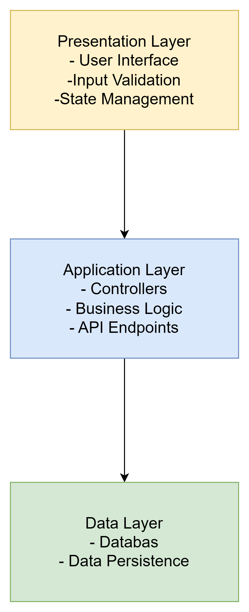

# 6. Flöden

### API

**Get;**

<figure><figcaption></figcaption></figure>

**Delete**

<figure><figcaption></figcaption></figure>

### I databasen ( inte hårdkodat)

Users-tabell:

| Id | Fornamn | Efternamn | Email             |
| -- | ------- | --------- | ----------------- |
| 1  | Anna    | Andersson | anna@example.com  |
| 2  | Kalle   | Karlsson  | kalle@example.com |
| 3  | Maria   | Svensson  | maria@example.com |
